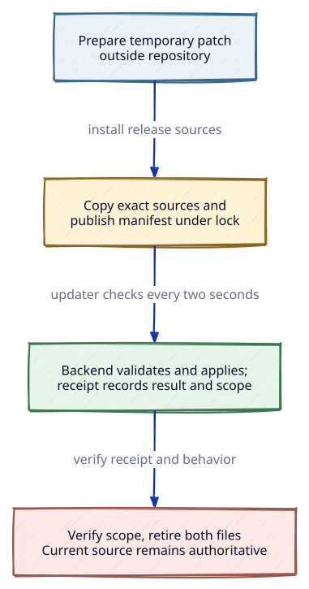

# Live updates

The backend can apply a reviewed Python patch to its running process without
restarting active agent connections. The live-update mechanism remains in
`workspaces/runtime/apps/server/src/codex_live_updates.py`; the publisher source is `workspaces/runtime/apps/server/src/codex-publish-update`.
No patch or `studio-live-update.json` manifest is stored in this repository.
Patches are temporary release artifacts and must be retired after verification.

## Lifecycle

Diagram contract
Purpose: How a temporary patch moves from preparation through verification and retirement.
Nodes: Temporary patch, release sources and manifest, running backend and receipt, verification, retired patch and manifest.
Relations: Prepare and copy the patch with current sources, publish the manifest, validate and apply it, verify behavior against the receipt scope, then retire both files.
Invariant: The patch and manifest are temporary; the current source tree remains authoritative after retirement.
Source: [docs/diagrams/live-update-lifecycle.d2](diagrams/live-update-lifecycle.d2)



The updater checks the manifest every two seconds. It holds a shared publication
lock while validating and applying. The publisher holds the same lock
exclusively while installing source files and publishing or retiring the
manifest. A partial installation, unknown source, or unsupported Python
version is rejected. Failed attempts retry with a bounded delay; a changed
manifest begins a new attempt immediately.

## Add a temporary patch

Prepare one patch for the current release outside the repository. Review and
test it against the exact running backend. Preserve existing objects and
callbacks, reject unknown implementations, and make a repeated call safe.
The patch must not send messages, restart agents, or repeat external work.

Copy the patch and the exact current production sources into the release
scripts directory under an exclusive lock on `scripts/.studio-update.lock`.
Release that lock, then publish the manifest with the Python 3.14 environment
used by the backend:

```sh
python3 workspaces/runtime/apps/server/src/codex-publish-update \
  --scripts /path/to/release/scripts \
  --patch codex_release_update.py \
  --id current-release \
  --scope 'Exact methods and behavior changed by this release'
```

The publisher takes the exclusive lock, hashes the complete production source
inventory, and atomically replaces `studio-live-update.json`. Sign the
application after publication, then install the complete artifact.

## Verify and retire

Read `live-update.json` in the existing state directory. The receipt records the
patch result or its error. New backend instances also expose it in
`/api/desktop` under `liveUpdate`. Check the process identity, release
identifier, status, and scope, then verify the changed behavior.

After verification, remove the manifest and temporary patch together while
holding the exclusive publication lock. Sign the application again after that
change. Keep the receipt in the state directory. New backend processes use the
current source directly and do not need the old patch.

`backendBuild` remains the source identity from process startup. A successful
patch receipt proves only its named scope. It does not claim that every loaded
module matches every installed file.

The backend starts the updater automatically. A successful update does not
restart the backend, close native connections, or change accepted message
identities.

## Limits

This mechanism applies reviewed live patches; it does not reload arbitrary
Python modules. A changed constructor, object layout, transport, or database
schema needs a separately validated transition. Without one, the updater
records an error and preserves running work.

Long-running frames can finish their previous implementation. A patch must
account for that behavior before publication. A failure after an external
operation cannot be repaired by automatically replaying it.

Run `python3 -B workspaces/runtime/apps/server/tests/live-updates-contract.py`,
`python3 -B workspaces/runtime/apps/server/tests/live-update-retirement-race-contract.py`, and
`node workspaces/client/apps/desktop/test.mjs` after changes to the mechanism. The desktop check uses
an isolated state directory and a hidden window.
