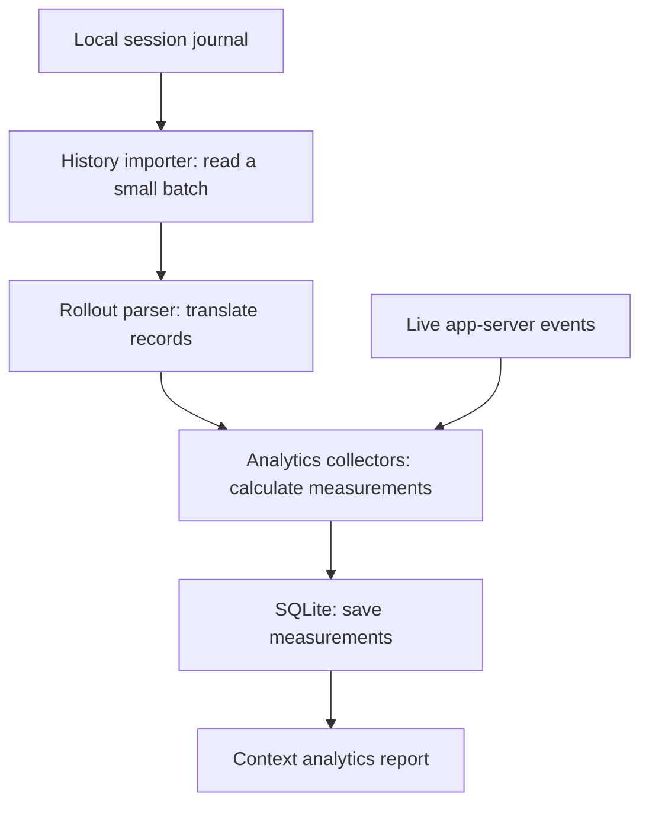

# Analytics components

## Change Contract

Keep the parser independent: it translates records in memory and never opens
files, writes a database, or starts an agent. The history importer owns those
operations. Preserve record order, response identity, and where each timestamp
came from. Field mappings live in [rollout_parser.py](rollout_parser.py); reading
limits and saved progress live in
[codex_analytics_history.py](../codex_analytics_history.py). Run the checks below
when changing this boundary.

## What analytics does

Analytics helps answer questions such as **“How many tokens did this agent use?”**,
**“How large was a tool's output?”**, and **“How long did a turn take?”**
Tokens are the units the model provider uses to measure text processing. Tool
output size is measured separately, in bytes and characters; it does not tell us
exactly how many tokens that tool cost.

Think of analytics as a record keeper. It observes what happened and prepares
measurements for Studio's **Context analytics** report. Reading old history does
not ask the model to work again. The full explanation of the report and its limits
belongs to [Context analytics](../../../../../../docs/analytics.md).

This folder currently contains one part of that system: **the rollout parser**.
A rollout is a local session journal, with one JSON record per line. A parser is
code that turns those records into a form the rest of the application understands.
The surrounding importer and report storage still live in the existing backend
modules; they have not all moved into this folder.

## How a journal becomes a report

The diagram follows older history from a local journal to the report. Live events
can also feed the same collectors. The importer reads and saves; the parser only
translates. This is the boundary that lets us test the parser on its own.



Diagram contract: the arrows show data flow, not new model requests. The history
path is owned by [the importer](../codex_analytics_history.py), which calls
[the parser](rollout_parser.py) and
[the collectors](../codex_analytics.py). The importer saves its place together
with the imported measurements, so an interrupted scan can continue. The Mermaid
block above is the editable diagram source.

For coalesced live assistant-delta callbacks, the collector aggregates fragment
notification counts and UTF-8 byte totals by hour, and applies turn first-output
and open-item stream metrics once per callback. The original per-fragment
measurements are preserved, including empty fragments. `firstOutputAt` follows
the first nonempty fragment in arrival order, even when its observed timestamp is
later than a following fragment. A failed aggregate is rolled back to a savepoint
before the existing per-fragment capture runs; each resulting error remains
isolated. Native item completion still supplies the authoritative final text.
This optimization stays inside one runtime notification transaction, so it does
not delay durable visibility or couple separate callbacks.

For example, a journal record may say “command finished, exit code 0, duration
1.5 seconds.” The parser translates field names and units into the collector's
format. The collector records the measurement; it does not run the command again.

To associate related records, the parser carries a small **context**: notes such
as the current thread, turn, and most recent response identity. The caller owns
these notes, passes them in record order, and starts with fresh notes for a new
replay. Input records are not modified, but returned results can refer to nested
parts of them, so callers must not edit those parts.

## Test

From the repository root, using only Python's standard library:

```sh
python3 -B -m unittest discover -s workspaces/runtime/apps/server/src/analytics/tests -v
python3 -B workspaces/runtime/apps/server/tests/analytics-history-connection-reuse-contract.py
python3 -B workspaces/runtime/apps/server/tests/budget-runtime-contract.py
python3 -B workspaces/runtime/apps/server/tests/analytics-delta-batch-contract.py
python3 -B workspaces/runtime/apps/server/src/analytics/benchmarks/bench_delta_batch.py
python3 -B workspaces/runtime/apps/server/src/analytics/benchmarks/bench_rollout.py --check
```

The local tests answer “Did we translate the record correctly?” They need no
server or database. The root tests answer “Does that translation still work when
we import history, resume an interrupted scan, and count usage?” They use temporary
databases, not your chats. `--check` verifies the synthetic benchmark workload
without installing pyperf or running timing measurements.

## Benchmark

A benchmark asks “How long does the same work take?” It is useful for comparing
two implementations only after both pass the correctness tests.

Create a separate environment and result directory outside the checkout. These
example commands use a new temporary directory; retain its path for comparisons:

```sh
bench_dir=$(mktemp -d "${TMPDIR:-/tmp}/studio-analytics-bench.XXXXXX")
python3 -m venv "$bench_dir/venv"
"$bench_dir/venv/bin/python" -m pip install -r workspaces/runtime/apps/server/src/analytics/benchmarks/requirements.txt
"$bench_dir/venv/bin/python" -B workspaces/runtime/apps/server/src/analytics/benchmarks/bench_rollout.py -o "$bench_dir/before.json"
# After changing the implementation, use the same environment and machine:
"$bench_dir/venv/bin/python" -B workspaces/runtime/apps/server/src/analytics/benchmarks/bench_rollout.py -o "$bench_dir/after.json"
"$bench_dir/venv/bin/python" -m pyperf compare_to "$bench_dir/before.json" "$bench_dir/after.json" --table
```

[bench_rollout.py](benchmarks/bench_rollout.py) measures the same synthetic journal
in two ways:

- **Translation only:** the JSON text has already been turned into Python objects.
- **JSON decoding + translation:** turning text into Python objects is included.

Both start with fresh context and collect output on each invocation. This avoids
accidentally measuring a shortcut caused by a previous run. Fixture file
reads and correctness checks happen before timing. The workload includes command
output, token usage association, compaction, completion, and an unknown record.
The optional development dependency is pinned in
[requirements.txt](benchmarks/requirements.txt); production needs no pyperf.

Times are per batch, not per record. These are synthetic parser measurements,
not database throughput, real model performance, or chat display latency. Compare
under similar machine load and preserve pyperf's instability warnings. A quick
`--fast` run checks the harness but is not evidence of an optimization.

To add a case, start with a correctness test and a synthetic fixture, then call
the production function from a named benchmark. Keep preparation outside timing
unless preparation is the operation being measured. A future implementation must
pass the same behavioral contracts before its timings can be compared.
